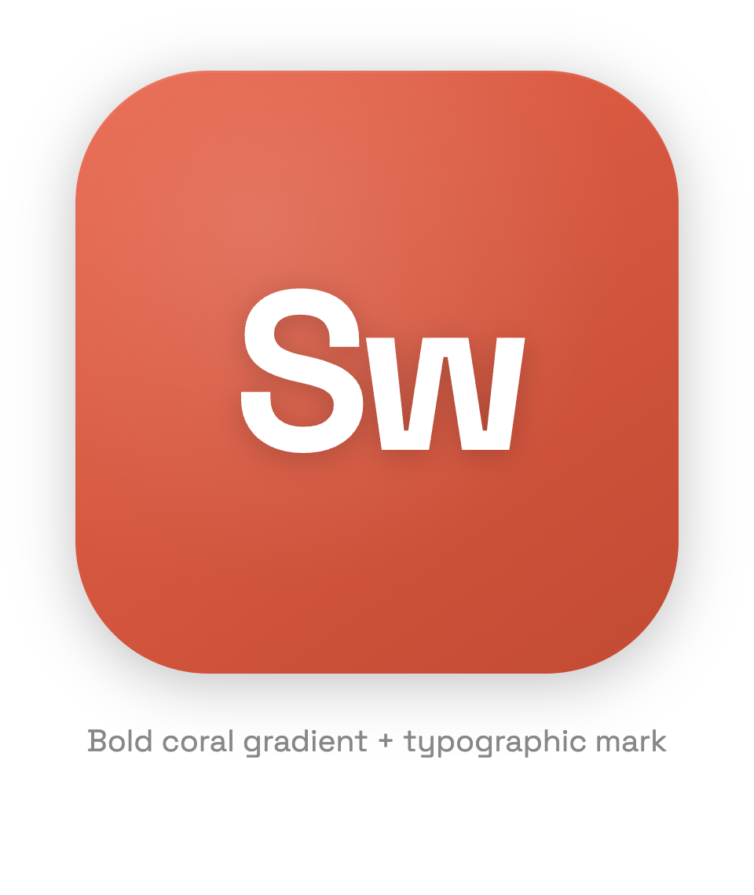

<div align="center">
  

  # Simple Whisper

  Batch transcription for video and audio. Drag, drop, transcribe to DOCX, MD, TXT, or PDF.

  <sub>Tauri 2 · SvelteKit · Groq Whisper · Google Gemini</sub>
</div>

---

## Overview

Simple Whisper is a desktop app that turns media into clean text. Drop a queue of videos onto the window — or paste a link and let yt-dlp fetch the audio — then pick a provider, model and language and hit transcribe. Each item streams through your chosen provider (Groq Whisper or Google Gemini), then exports to your chosen format. Everything stays on your machine except the audio sent to the provider for inference.

- **Two providers.** Groq Whisper (fast pure ASR) or Google Gemini (cheaper hourly, native speaker diarization).
- **Speaker diarization.** Gemini path labels turns as `Hablante A/B/C…`, rendered as bold paragraph prefixes in DOCX/MD.
- **Multi-file queue.** Sequential processing with per-file status, progress, and inline preview.
- **Four output formats.** DOCX, Markdown, TXT, PDF (Latin-1 only).
- **Auto-chunking.** Files larger than the provider's per-request cap are split with FFmpeg, then stitched back together (24 MB / 90 min for Groq, 14 MB / 30 min for Gemini to fit base64-inlined audio under the 20 MB request cap).
- **Transcribe from a link.** Paste, type or drop a URL and yt-dlp downloads just the audio, with live download progress (percent, speed, ETA). Playlists expand into individual queue items after a confirmation. Optional `--cookies-from-browser` for videos that need a signed-in session.
- **Native drag-and-drop.** OS-level paths via Tauri's webview event, not browser-only.
- **Settings drawer.** Theme, provider, model, language, format, diarization, API key, all live.
- **Per-provider key storage.** Separate macOS Keychain entries for each provider (`groq_api_key`, `gemini_api_key`), encrypted plugin-store fallback for unsigned dev builds.

## Screenshot

<div align="center">
  
</div>

> [!NOTE]
> Dark UI by default. Coral `#e8634a` accent. Self-hosted Lora.

## Prerequisites

> [!IMPORTANT]
> FFmpeg must be installed and reachable. On macOS GUI launches the app probes `/opt/homebrew/bin`, `/usr/local/bin`, `/opt/local/bin`, `/usr/bin` before falling back to `PATH`.

| Tool          | Why                                     | Install                              |
|---------------|-----------------------------------------|--------------------------------------|
| Node ≥ 20     | Frontend toolchain                      | <https://nodejs.org>                 |
| pnpm          | Package manager                         | `npm i -g pnpm`                      |
| Rust stable   | Tauri backend                           | <https://rustup.rs>                  |
| FFmpeg        | Audio extraction + chunking             | `brew install ffmpeg` (macOS)        |
| yt-dlp        | *Optional* — transcribing links         | `brew install yt-dlp` (macOS)        |
| Groq API key  | Whisper inference (`gsk_*` format)      | <https://console.groq.com/keys>      |
| Gemini API key| Gemini inference (`AIza*` format)       | <https://aistudio.google.com/apikey> |

At least one provider key is required. You can configure both and switch between them in Ajustes.

yt-dlp is only needed to transcribe links — local files work without it, and there is no startup nag if it is absent. Ajustes › Descargas shows the detected version. It is probed in `/opt/homebrew/bin`, `/usr/local/bin`, `/opt/local/bin`, `/usr/bin` and `~/.local/bin` (for `pipx install yt-dlp`) before falling back to `PATH`.

### Browser cookies

Some videos require a signed-in session (private, members-only, age-gated). Ajustes › Descargas lets you pick one of `brave, chrome, chromium, edge, firefox, opera, safari, vivaldi, whale`, which is passed to yt-dlp as `--cookies-from-browser`. Cookies are read locally by yt-dlp and never leave your machine.

macOS caveats: Safari requires granting the app **Full Disk Access**, and Chromium-family browsers trigger a Keychain prompt the first time cookies are decrypted. Both cases surface as a specific error on the card rather than a generic failure.

## Run

```sh
pnpm install
pnpm tauri dev
```

## Build

```sh
pnpm tauri build
```

Bundles land in `src-tauri/target/release/bundle/`:

- `macos/simple-whisper.app`
- `dmg/simple-whisper_<version>_<arch>.dmg`

## Install from a release

Grab the latest DMG from [Releases](https://github.com/ARKye03/simple-whisper/releases):

- `simple-whisper_<version>_aarch64.dmg` — Apple Silicon (M1/M2/M3/M4)
- `simple-whisper_<version>_x64.dmg` — Intel Mac
- `simple-whisper_<version>_x64-setup.exe` / `.msi` — Windows

> [!WARNING]
> macOS builds are unsigned. Gatekeeper marks the app as "damaged" on first launch. Strip the quarantine xattr after dragging the app to `/Applications`:
>
> ```sh
> xattr -cr /Applications/simple-whisper.app
> ```
>
> Then open normally. One-time fix per install.

## Configure

Open the gear icon (top-right), pick a provider, and paste the matching API key. Saved automatically on input (350 ms debounce). Each provider stores its own key independently, so you can keep both and flip between them. Validation: Groq keys match `gsk_*`; Gemini keys match `AIza*`.

| Setting       | Options                                                                            |
|---------------|------------------------------------------------------------------------------------|
| Theme         | Light, Dark, System                                                                |
| Provider      | Groq, Gemini                                                                       |
| Model (Groq)  | `whisper-large-v3-turbo`, `whisper-large-v3`                                       |
| Model (Gemini)| `gemini-3.1-flash-lite`, `gemini-3-flash-preview`                                  |
| Language      | Auto, ES, EN, FR, DE, PT, IT, JA, ZH                                               |
| Diarization   | On / off (Gemini only; segments output by speaker)                                 |
| Format        | TXT, MD, DOCX, PDF (PDF disabled for JA/ZH)                                        |

> [!WARNING]
> PDF export uses Helvetica WinAnsi: Latin-1 only. Use DOCX, MD, or TXT for CJK or other non-Latin scripts.

## How it works

```
URL only:
link         ->  yt-dlp -J --skip-download        ->  title, duration, uploader,
                 (is it live? a playlist?)            entries[] for playlists
link         ->  yt-dlp -f 'bestaudio*/best'      ->  downloads/<job>/source.<ext>
                 (progress streamed to the UI over a tauri Channel)

Both paths:
video/audio  ->  ffmpeg -ar 16000 -ac 1 -b:a 32k                   ->  audio.mp3

Groq path:
audio.mp3    ->  size > 24 MB?  ->  yes: ffmpeg -f segment -segment_time 5400
                                    no:  use as-is
chunks[]     ->  POST groq.com/openai/v1/audio/transcriptions      (multipart, per chunk)
texts[]      ->  joined with "\n\n"                                -> Transcript::Plain

Gemini path:
audio.mp3    ->  size > 14 MB?  ->  yes: ffmpeg -f segment -segment_time 1800
                                    no:  use as-is
chunks[]     ->  base64 inline JSON POST to
                 generativelanguage.googleapis.com/v1beta/models/{model}:generateContent
                 (with response_schema when diarize=on)
output[]     ->  diarize on:  Vec<TranscriptSegment{speaker,text}> -> Transcript::Diarized
                 diarize off: text concat                          -> Transcript::Plain

Transcript   ->  user picks export format (TXT / MD / DOCX / PDF)
```

All FFmpeg and yt-dlp calls go through `tokio::process::Command` directly. No `tauri-plugin-shell` dependency. The 14 MB Gemini chunk cap is the source-file threshold; after base64 inflation (~33 %) it fits inside Gemini's 20 MB inline-request cap.

Downloads land in a per-job temp directory that is deleted whether the transcription succeeds or fails; a stale-directory sweep reclaims anything a hard quit left behind, and the yt-dlp child is killed if the app exits mid-download. Live streams are rejected before any download starts.

> [!NOTE]
> There is no cancel button yet. The download is the shortest phase — the provider HTTP calls dominate wall-clock time and are not cancellable today — so a Cancel that stopped working the moment "Descargando" became "Procesando" would be worse than none. Cancellation will land as one change covering both phases.

> [!NOTE]
> Gemini does not see prior chunks when transcribing. Speaker labels (`A`, `B`, …) restart at the beginning of each chunk, so a long file split across multiple requests can have label drift between chunks. v1 ships with this limitation.

## Privacy

| Data            | Location                                                                                                      |
|-----------------|---------------------------------------------------------------------------------------------------------------|
| API keys        | macOS Keychain (service `com.arkye03.simple-whisper`, accounts `groq_api_key` / `gemini_api_key`) or fallback |
| Settings        | `~/Library/Application Support/com.arkye03.simple-whisper/settings.json`                                      |
| Audio chunks    | `$TMPDIR/simple-whisper/` (system-managed cleanup)                                                            |
| Transcriptions  | Saved where you choose, nowhere else                                                                          |
| Telemetry       | None                                                                                                          |

Audio is sent to the selected provider (Groq or Google) for inference. Their respective data policies apply; transcripts are not stored remotely by Simple Whisper.

## Tech stack

- **Frontend.** SvelteKit + Svelte 5 runes, static adapter, self-hosted Lora.
- **Desktop shell.** Tauri 2 (`tauri`, `tauri-plugin-dialog`, `tauri-plugin-store`, `tauri-plugin-opener`).
- **Transcription.** Groq hosted Whisper (`whisper-large-v3-turbo` / `whisper-large-v3`) or Google Gemini (`gemini-3.1-flash-lite` / `gemini-3-flash-preview`).
- **HTTP.** `reqwest` (rustls, multipart for Groq, JSON+base64 for Gemini).
- **Export.** `docx-rs`, `printpdf` (0.7), plain `std::fs` for TXT/MD.
- **Secrets.** `keyring` 3.x (macOS Security framework backend), one entry per provider.

## Acknowledgments

- [Groq](https://groq.com) for the Whisper inference API.
- [OpenAI Whisper](https://github.com/openai/whisper), the underlying ASR model.
- [Google Gemini](https://ai.google.dev/) for the multimodal model with native diarization.
- [Tauri](https://tauri.app) for letting a Rust + web stack feel native.
- [Lora](https://fonts.google.com/specimen/Lora) by Cyreal, typography.
